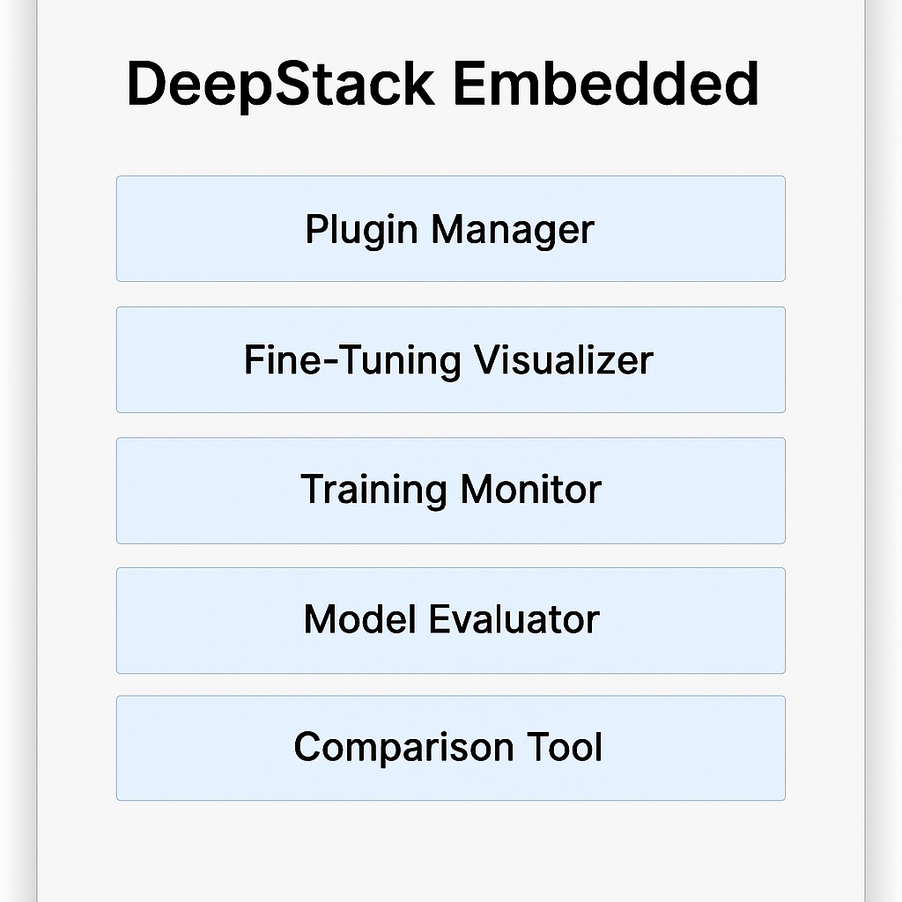
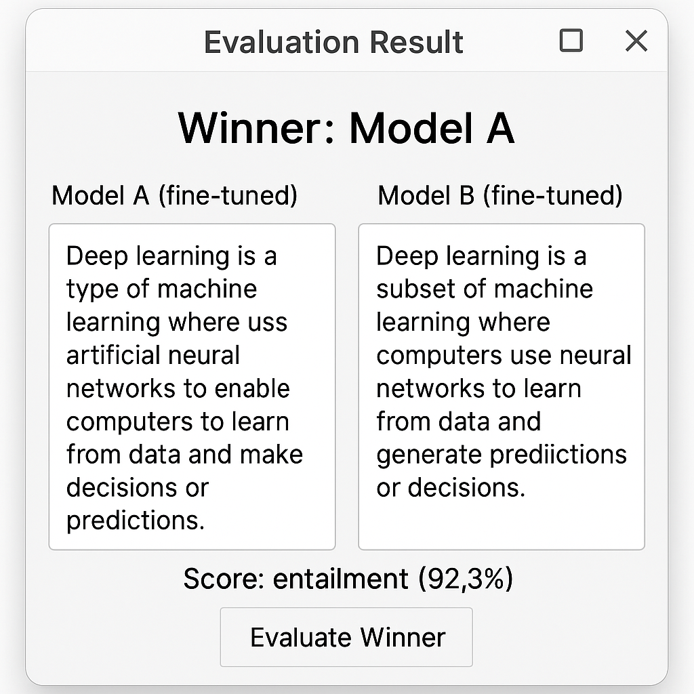

# 🧠 DeepStack Embedded


Modular LLM desktop suite with plugin support, fine-tuning, model comparison, AI evaluation, and auto-release.

---

## 🖥 Preview





---

## 🚀 Features

| Module             | Description                                                                 |
|--------------------|-----------------------------------------------------------------------------|
| 🔌 **Plugin Loader**     | Drop-in architecture for AI toolchains and custom extensions              |
| ⚖️ **Model Comparison** | Side-by-side prompt tests with AI-evaluated winner                        |
| 🧪 **Output Evaluator**  | Uses MNLI or reward models to score output quality                        |
| 📊 **Training Visualizer** | Real-time log viewer for training progress                                 |
| 🛠 **Fine-Tuning Engine**| HuggingFace LoRA support for LLaMA / DeepSeek                             |
| 🔐 **Signed Releases**   | `.exe` and `.msi` created and published via GitHub Actions                |
| 🧰 **One-click Build**   | Simple `.bat` scripts for full lifecycle                                  |

---

## 📦 Installation

```bash
git clone https://github.com/nectarface/deepstack.git
cd deepstack
build_full_embedded.bat
```

To install via `.msi`:
```bash
"C:\Program Files (x86)\Inno Setup 6\ISCC.exe" DeepStackInstaller_Embedded.iss
```

---

## 📤 Releasing

1. Make sure `.exe` and `.msi` are built
2. Tag the release:
```bash
git tag v2.0.0
git push origin v2.0.0
```

---

## 🧠 Fine-Tuning Folder Structure

```
models/
└── fine_tuned/
    ├── model_a/       # HuggingFace model for left side
    └── model_b/       # HuggingFace model for right side
```

---

## 🧪 Evaluator Logic

- Uses `facebook/bart-large-mnli` or similar for prompt-matching
- Future support: OpenAI GPT-Judge, OpenAssistant reward model, Claude Eval

---

## 🧰 Utility Scripts

| Script                   | Purpose                           |
|--------------------------|-----------------------------------|
| `build_full_embedded.bat`| Build GUI `.exe` from launcher    |
| `build_tray_msi.bat`     | Compile signed installer          |
| `sign_all.bat`           | Sign `.exe` and `.msi` using PFX  |
| `tag_and_release.bat`    | Push version tag to GitHub        |

---

## 📜 License

MIT (you may replace this with your license of choice)

---

## 📷 Add UI Screenshots

Drag these images into:  
```
/assets/
├── gui_main.png
├── comparison_tool.png
├── evaluator_result.png
```

---

